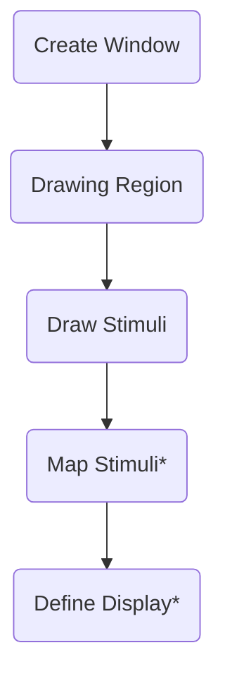

# Overview

There are five basic sections to making a workflow in BonVision. 

> [!NOTE]
> Map Stimuli and Define Display steps are optional and can be skipped when prototyping

## Create Window

All BonVision workflows need to start by creating a display window and loading the essential BonVision resources. If additional resources
such as 3D models and textures are required, load them at this step using the optional `SceneResources` and `TextureResources` node.

> [!NOTE]
> You can copy the workflows below directly into Bonsai by clicking the copy button on the top right of the container.

:::workflow

:::

## Drawing Region

This defines which region of visual space is used for the visual world.
Ideally one should use `OrthographicView`. This defines everything in terms of visual angles.

:::workflow

:::

If you are just prototyping stimuli, one can use `NormalisedView`.

:::workflow

:::

> [!NOTE]
> Note that this can be larger than the actual region used. 

### Draw Stimuli

This is where you generate all the aspects of the visual environment which will be covered in more details in later sections.

:::workflow

:::

> [!NOTE]
> At this point you have all the basic parts necessary to create and prototype visual environments. The workflow below encapsulates all these steps and draws a simple black and white circle. 
> Copy it into Bonsai and try it out!

:::workflow

:::

### Map Stimuli (optional)

This is where the stimulus is rendered onto a a surface. This can be skipped for prototyping. Ideally one should use `SphereMapping`. 
If `SphereMapping` is used, the Define display section next is necessary

### Define Display (optional)

Here we define the parameters of the display system (eg. monitor) by adding a `ViewingWindow` and a `DrawViewport` node.

> [!Warning]
> For some reason an error in the SphereMapping workflow below crops up for me, I have included it in case someone can troubleshoot it for me.

:::workflow

:::

Additional displays can be defined by adding multiple `ViewingWindow`/`DrawViewport` nodes.

:::workflow

:::

### Video Walkthrough

<iframe width=100%  height="282" src="https://www.youtube.com/embed/x-J6kIZvOwA" title="BonVision quick tips: Making your first BonVision workflow" frameborder="0" allow="accelerometer; autoplay; clipboard-write; encrypted-media; gyroscope; picture-in-picture; web-share" referrerpolicy="strict-origin-when-cross-origin" allowfullscreen></iframe>

