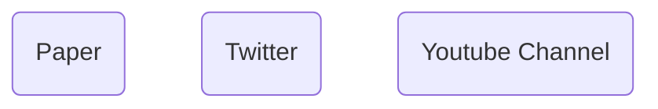

# BonVision
An open-source software package to create and control visual environments.

BonVision is developed by the [Saleem Lab](https://www.saleemlab.com/) & [Solomon Lab](https://solomonlab.info/) at the UCL Institute of Behavioural Neuroscience in collaboration with [NeuroGEARS](https://neurogears.org/).

BonVision’s key features include:

- Naturally closed-loop system based on reactive coding of the Bonsai framework
- Handles 2D and 3D stimuli with equal ease
- Visual environment generated independent of display configuration
- Graphical programming language of the Bonsai framework
- Can be used for Augmented Reality, Virtual Reality or 2D visual stimuli
- Does not require the observer to be in a fixed position

# Demos
## Augmented Reality
{width=500} 

An example where we render a 3D object and a dynamic 2D stimulus simultaneously